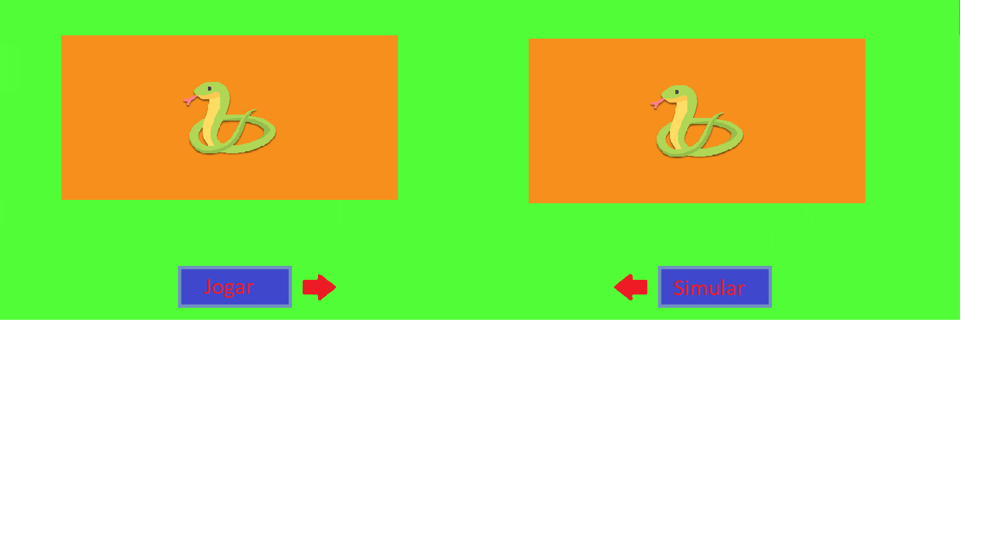

# Snake-IA



Jogo da Cobra com agente que executa algoritmos de busca.

* Escrito em python
* Busca Gulosa
* Busca Gulosa em profundidade
* RRT (Árvorae aletatória de exploração rápida)


## Instalação

* Baixar o python3 da [página oficial](https://www.python.org/downloads/).

* Baixar a biblioteca `pygame` com o comando `pip` no terminal.

```
pip3 install pygame
```

## Executar o programa
Baixe o código do repositório e execute o arquivo como qualquer outro script python.
```
python Snake_Game.py
```

## Botones y configuraciones

![Controles]

Na tela inicial (menu principal), podemos optar por jogar ou iniciar a simulação com os agente, executando os algoritmos de busca.

![Menu]

Para escolher um algoritmo para o agente, devemos iniciar a simulação selecionando `simulação` no menu principal e depois pressionar `Espaço` para pausar e escolher o algoritmo de nossa escolha.

Por padrão é definido `Greedy_Priority`

![Algoritmo]

Basta pressionar novamente `Espaço` para retornar à simulação e o agente executará o algoritmo selecionado em sua próxima busca.


